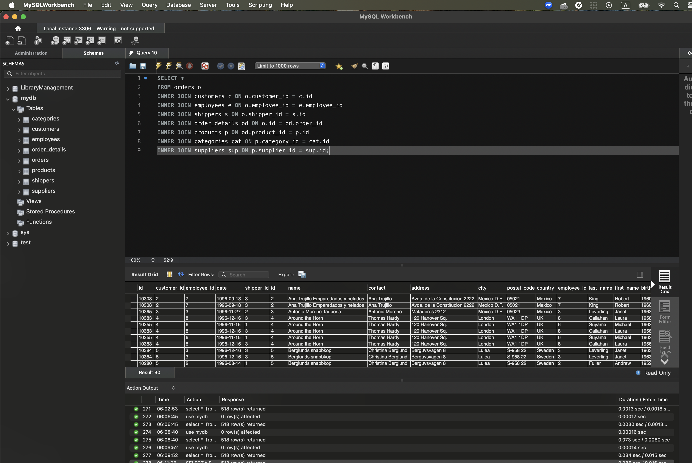

## Завдання 3

Перейдіть до бази даних, з якою працювали у темі 3. Напишіть запит за допомогою операторів FROM та INNER JOIN, що об’єднує всі таблиці даних, які ми завантажили з файлів: order_details, orders, customers, products, categories, employees, shippers, suppliers. Для цього ви маєте знайти спільні ключі.

Перевірте правильність виконання запиту.

