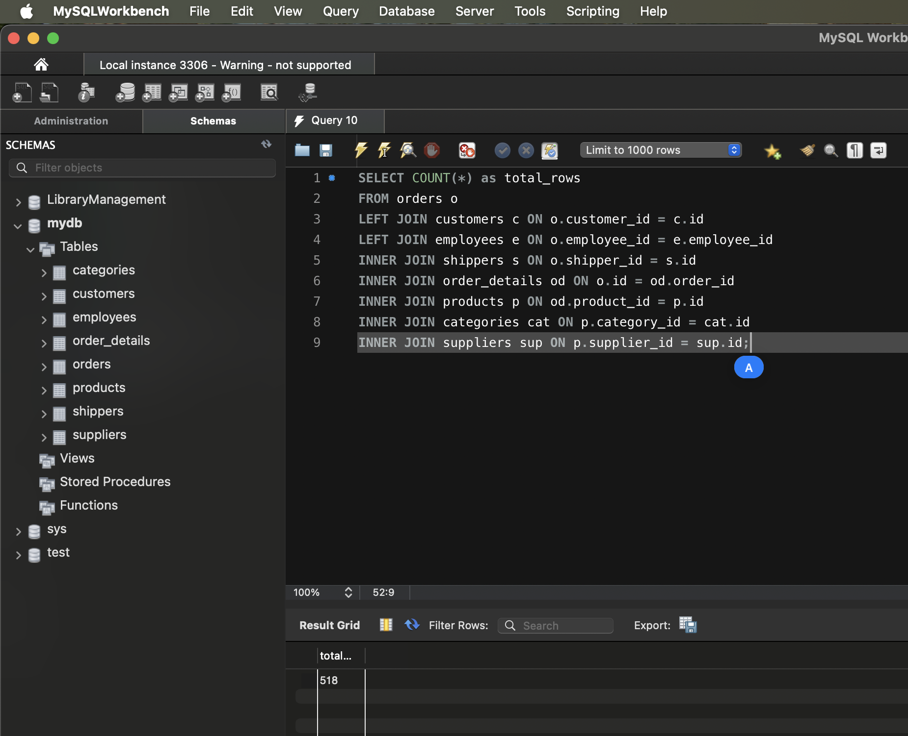

## Завдання

Визначте, скільки рядків ви отримали (за допомогою оператора COUNT).

Змініть декілька операторів INNER на LEFT чи RIGHT. Визначте, що відбувається з кількістю рядків. Чому? Напишіть відповідь у текстовому файлі.

## Відповідь

Кількість рядків може збільшитися, тому що LEFT JOIN включає всі записи з лівої таблиці, навіть якщо немає відповідних записів у правій таблиці.

